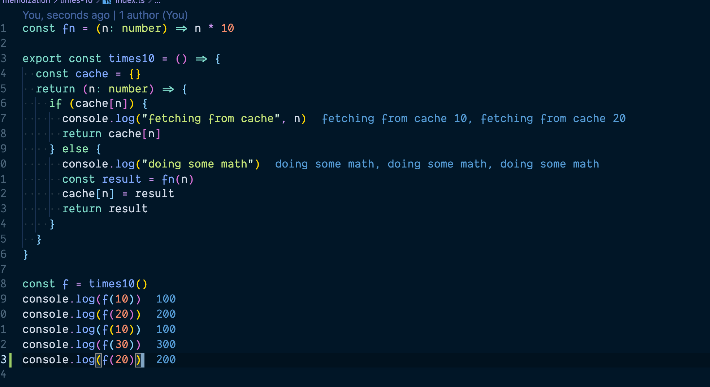
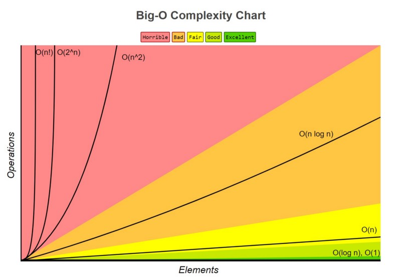

# Data structures and algorithms

## Table of Contents

- [About](#about)
- [Topics](#topics)

## About <a name = "about"></a>

Data structures and algorithms, understanding the fundamentals and concepts of why we use them why we should know them and how to apply them. The key concept is to ask yourself _why_?
Why are we using these techniques, do we really need them?

## Topics <a name = "topics"></a>

- [Data structures](#ds)
  - [Array](#array)
  - Linked lists
  - Stacks
  - Queues
  - Graphs
  - Trees
- Algorithms
  - [big o](#big-o)
  - searching
  - sorting
  - [recursion](#recursion)
  - caching
  - [memoization](#memo)
- Patterns
  - sliding window
  - frequent pattern

### Example when we use the memoize technique



## Big O <a name = "big-o"></a>

Is a way of measure our algorithms both in `time complexity` and space `complexity`.

_Time Complexity_
How many primitive operations are executed?

_Space Complexity_
How much memory is used?

**Big O table of measurement**

- O(1) constant time = Good
- O(n) linear time = OK
- O(n log n) = Bad
- O(n^2) = Horrible
- O(n^n) = Horrible\*2
- O(n!) = Horrible\*100000000



### Recursion <a name = "recursion"></a>

Recursion is simply when a function calls itself, however it is not the end here!
It's just more then that, it's a technique a mindset a way of solving a problem.

Why do we use `recursion`?
It is a elegant solution and mostly a more readable solution then a regular iteration.
Sometimes it is solution that we _must_ use, for example when traversing a `tree data-structure`.

#### Thinks we need cover when creating a recursive function

- We need a base case
- Identify recursive cases
- return when it time to return (when we have arrived at our condition)

### Memoization <a name = "memo"></a>

---

## Data Structures <a name = "ds"></a>

### Array <a name = "array"></a>

Depending if we are appending to the front or back the time complexity will not be the same. Insert at the end of the array is a constant time because we know where to insert it and don't have to change any position of the other elements in the array.

Inserting at the front will however move every element `index + 1` to the right because the new element will be at position `0`.

So pushing to the array at the end is `O(1)` constant time
While unshifting is `O(n)` linear time

**What is array good for?**
| pros | cons |
|--------------|--------------|
| fast lookup | slow insert |
| fast appends | slow deletes |
| | |
| | |

While stings are immutable in Javascript working with strong in any problem solving task, like a coding interview, converting the string in to a array is very handy, with a lot of powerful array methods that we have in `javascript`, like `map` `reduce`,`filter` for example.

#### Extra

How I bundle my `ts` files with `Deno`.

```bash
  deno bundle src/data-structures/stack/stack.ts bundle.js
```
