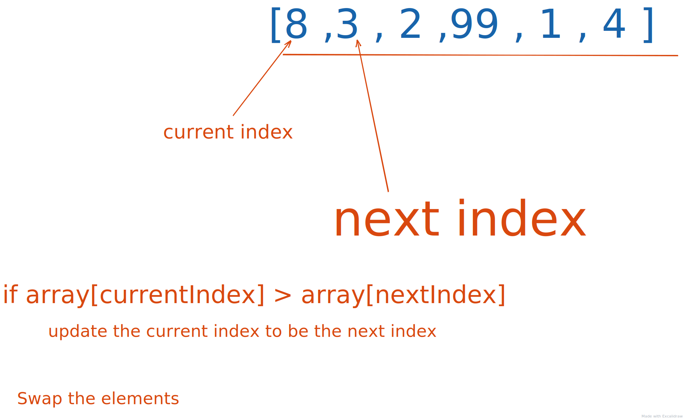

# Selection sort

## Time complexity

- time `O(n^2)`
- space `O(1)`

1. Store the current index, `(0)`
2. iterate over the list and assign smallest to current index
3. check if where we are now in the list is greather then the next element.
4. if true, then update the smallest index
5. make a swap of the elements
6. return array

