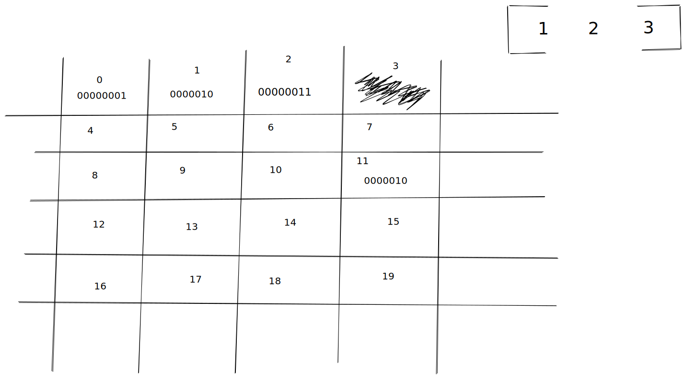

# Content

- [Data structures](#ds)
- [Memory](#memory)

## Data Structures <a name = "ds"></a>

So what is actually a data structure?
When you are working with data could be reading form and database, manipulating data,
then you will work with different data structures. Everything from `strings`,`graphs`,`arrays`,`linked-lists`,`trees` and much more...

Data structure is just a way of gather and organize a collection of data.

```
  1-->2-->-->3-->4

        99
  22 <-   -> 101

  ["a", "b", "c"]
```

## Complexity Analysis

#### 3 key terms:

- Complexity-Analysis = the process of determining how efficient an algorithm is. Complexity analysis involves finding both the time complexity and space complexity of an algorithm.
  Complexity analysis is effectively used to determining how `good` and algorithm is and whether it is `better` then another one.

- Time complexity = measure of how fast an algorithm runs, time complexity is a central concept of the field algorithm and in coding interviews.

- Space complexity = A measure of how much memory an algorithm take sup, space complexity is a central concept of the field algorithm.

<hr/>

## Memory Analysis <a name = "memory"></a>

To really grab a better understanding of how complexity analysis and **data structures** works,
we need to know what is memory how does it work and effect our daily job as a soft-ware engineer.

as soon we declare a new variable we store some data on the memory. I like the visualize that we store some kind of value in a box and as soon we need to refer to our box,`variable` we open the box and out comes the stored value.

```rust
// in box x we store a value of 45 which is a signed 32-bit integer
  let x:i32 = 45;
```

#### Key terms

- **Bit**
  Short for `binary digit` , a bit is a fundamental unit of information in Computer Science that represents a
  state with one of two values, typically `0` and `1`.
  Any data stored in a computer is, at the most basic level, represented in bits.

- **Byte**
  A group of eight `bits` for example _00011000_ is a byte.
  a single byte can represent up to _256_ data values `(2^8)`
  Since n `binary number` is a number expressed with only two symbols, like `0` and `1`,
  a byte can effectively represent all of the numbers
  between 0 and 255, inclusive, in binary format.

  The following bytes represent the numbers 1, 2, 3, and 4 in binary format.
  <pre>
  1: 00000001
  2: 00000010
  3: 00000011
  4: 00000100
  </pre>

- **Fixed-Width Integer**
  An integer represented by a fixed amount of `bits` for example a `32-bit` integer is an integer representing by 32 bits which is `4 bytes` and a 64-bits integer represent `8 bytes`.
  In Java you have integer which is a `32-bit` integer and a **long** representing `64-bit` integer.

  The following is the 32-bit representation of the number 1, with clearly
  separated bytes:
    <pre>00000000 00000000 00000000 00000001</pre>

  The following is the 64-bit representation of the number 10, with clearly
  separated bytes:
    <pre>00000000 00000000 00000000 00000000 00000000 00000000 00000000 00001010</pre>

  Regardless of how large an integer is, its fixed-width-integer representation
  is, by definition, made up of a constant number of bits.

  It follows that, regardless of how large an integer is, an operation performed
  on its fixed-width-integer representation consists of a constant number of bit
  manipulations, since the integer is made up of a fixed number of bits.

- **Memory**
  Memory is the foundational layer of computing, where all data is stored.

  **It's important to note the following points:**

  - Data stored in memory is stored in bytes and, by extension, bits.
  - Bytes in memory can "point" to other bytes in memory, so as to store
    references to other data.

  - The amount of memory that a machine has is bounded, making it valuable to
    limit how much memory an algorithm takes up.

  - Accessing a byte or a fixed number of bytes (like 4 bytes or 8 bytes in the
    case of **32-bit** and **64-bit integers** ) is an elementary
    operation, which can be loosely treated as a single unit of operational
    work.


