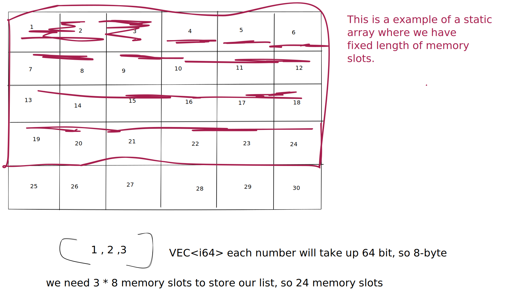

# Arrays

Perhaps the most common data structure and most fun to work with if you ask me.

A static list is an implementation of an list that allocates a fixed amount of memory to store the list values. Adding new values to the list `(static)` we beed to make a whole copy of the list and create a new one with a extra memory spot for our new value. This is a linear-time operation.

Dynamic lists allocates double the amount of memory needed to store the lists values.
Appending values to the list is a `constant-time` operation, until the allocated memory is filled up.This implementation leads to an amortized `constant-time` operation.
Dynamic lists are common in languages like: `JS`,`Python`.
In `Rust` we use so called `vectors` as dynamic arrays.

## Key terms

A linear collection of data values are accessible at number indices, starting at index 0.
Following opperation descripes time complexity on a array.

- **Get the value by index** O(1)
- **Updating the value by index** O(1)
- **Inserting the value by index** O(n) if we don't add to the end!
- **Inserting the value at the end** O(1) if the array is dynamic then we get a constant time complexity. If the array is static then we get a linear time complexity O(n).

- **Removing the value from the beginning** O(n)
- **Removing the value at the end** O(1)
- **cloning the array** O(n)
