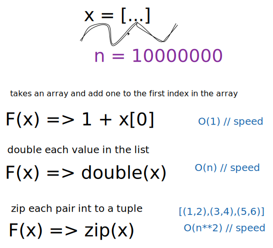

[Big-o](#big-o)
[Key](#key)

## Big-O 

We use `Big-o` to measure both time and space complexity in a algorithm.

So we have three functions here that takes a array as a parameter and do some kind of transforming on them.

The first one is just adding one to the first index in the list, no looping here.

The second will iterate over the whole list and double each item, loop through the whole list.

The third function will zip each pair into a tuple and iterate through the whole list once and one extra loop in each item.

Now we want to measure all 3 functions what time and space complexity they have.

We can se that the first one has time complexity of `O(1)` which is constant time and is really fast. The algorithm is not depending to that the list will grow, it will always take `O(1)` time to calculate the first value. Getting a item by index in array is `O(1)` operation when we measure speed.

Comparing to the other 2 functions they are a little bit different. There time complexity depends on how much our list will grow. So the second have a time complexity of `O(n)` linear time.
And the last one will have `O(n^2)` because we creating here a nested loop where we iterate through the list + each item in the list.

## Key terms 

The notation used to describe the `time complexity` adn `space complexity` of algorithms.

Variables used in Big O notation denote the sizes of inputs to algorithms. For example, `Big(0)` might be the time complexity of an algorithm that traverses through an array of length.
`O(n+m)` might be the time complexity of an algorithm that traverses through an array of length `n` and through an array of length `m`.

The following are examples of common complexities and their Big O notations, ordered from fastest to slowest:

- `constant`: O(1)
- `Logarithmic`: O(log(n))
- `Linear`: O(n)
- `Log-Linear`: O(nlog(n))
- `Quadratic`: O(n\*\*2)
- `Cubic`: O(n\*\*3)
- `Exponential`: O(2\*\*n)
- `Factorial`: O(n!)

  Note that Big O notation is usually understood to describe the `worst` complexity of an algorithm, even though the worst-case complexity might differ from the `average-case` of time complexity.

  Let's say we want to sort a list, there a different time complexity of different algorithms on how they handle the task. In rare cases, their time complexity will be much worse than in more common cases. Similarly, an algorithm that takes in a string and uppercase the first letter comparing uppercase all letters will have different time complexity.

  Thus, when describing the time complexity of an algorithm, it can sometimes be
  helpful to specify whether the time complexity refers to the average case or
  to the worst case (e.g., "this algorithm runs in `O(nlog(n))` time on average
  and in `O(n**2)` time in the worst case.
