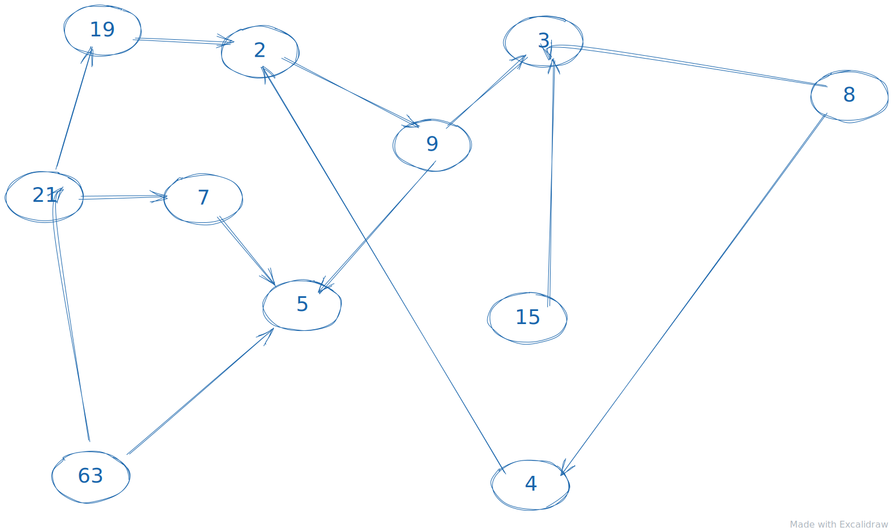
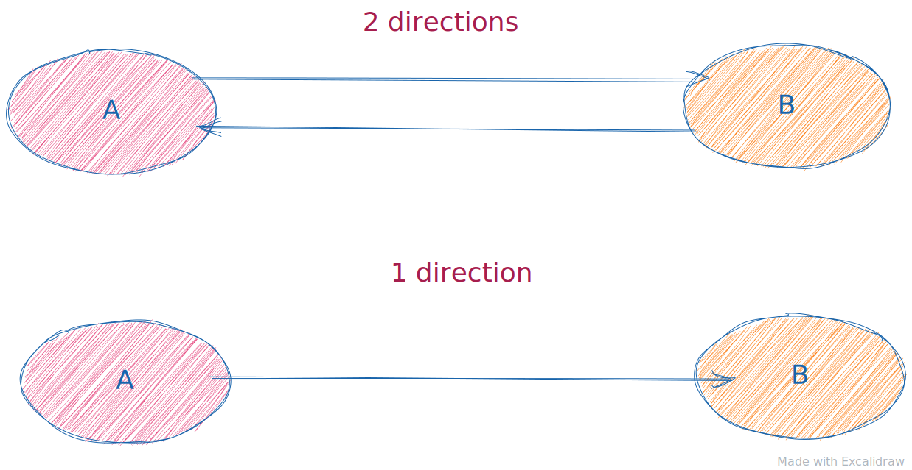
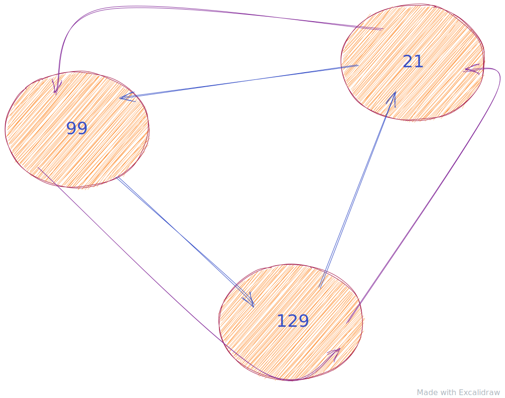

## Graphs

A graph is a collection of nodes that may be or not connected to each other.
See it like a large social network you have a lot of friends but all of your friends also have their friends and you don't know all of them

**A not connected graph**

The elements is so called `nodes`.
The arrows represent the `connections` between the nodes.
Every `node` is vertex in the `Graph`.
The connections`(arrows)` is so called `edges`.
So a graph is made up of 2 special things, vertices and `edges`.

There are a lot off different types of `Graphs`. They all following different patterns and rules.

A `Graph` is connected if you can reach another `node` from another `node`. If this is not possible then the `Graph` is not connected like the image above.

The arrows also representing directions, if the arrow only point in one way then we can only go that way.

A good mental model for this is Flights. For example you buy one way ticket that is one directed edge, it is directed.
If you would buy a two way ticket then the connections would point both to destination `B` and back to destination `A`.

We can also find `cycles`, a cycle is when one of the edges has at least 3 ore more connections that will cause a infinitive loop, you can keep go through the same direction and will always pass your 3 edges.

#### Graph concepts

- `Graph`: A collection of nodes or values called, `Vertices` that might be related; relations between vertices are called `edges`.

- `Graph Cycle`: A cycle occurs in a `Graph` when three or more `Vertices` in the graph are connected so as to form a closed loop.

- `Acyclic Graph`: A `Graph` that has no cycles.

- `Undirected`: A `Graph` whose edges are undirected, they cant be traversed in both directions.

Time complexity to traverse a `Graph` either with `BFS` ore `DFS` is `O(V+E)`.
Every Vertex and for every edges is what we need to traverse.
