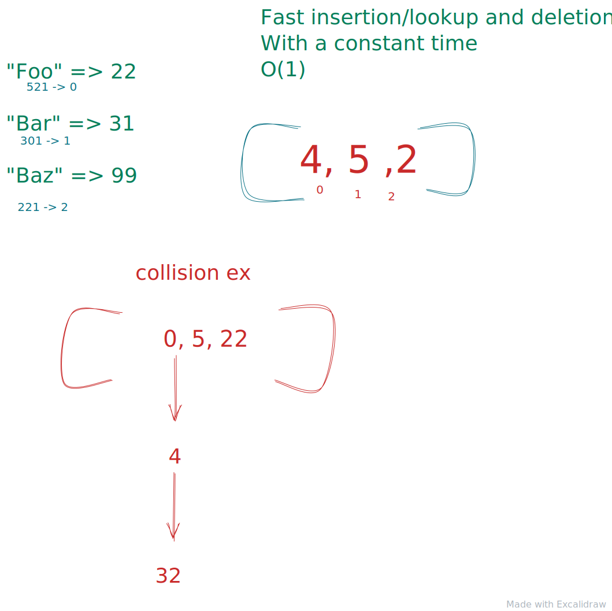

# Hash Tables

Hash tables are really useful. They called differently depending what language u using.
`HashMaps`,`Objects`,`Dictionaries` are just some cases.

In `JS` we are used to call the objects.

Hashmaps are very complex under the hood, with some complex hashing functions that generate the key into array index
Hashmaps are built with arrays under the hood, that's why we have fast lookups with hashmaps.
But sometimes it can go wrong, we could hash a key in the same spot where we already put a index before.
We got a collision!.

There as different way to solve coalitions, one approach would be to create a linked list on the same spot where we want to inert the new value.

`Hash tables` are fast and flexible. With fast `insertions`,`deletion` and `lookup` of key/value pair with a time complexity of constant time `O(1)` on average but `O(n)` at worst case.
This a why Hash-maps are so fascinating. We usually don't care about the average time but in this case we do.
The more collisions we get the more we would run to a linear approach.
There are some really smart people out there that found a solution with really god hashing function that will try to avoid collisions at any point.

```
[
  0: (v1,key1) -> null
  1: (v1,key1) -> (v2,key3) -> (v3,key)
  2: (v5,key6) -> null
]
```



`insertion`: O(1) average, O(n) worst case _(collisions)_
`deletions`: O(1) average, O(n) worst case _(collisions)_
`lookups`: O(1) average, O(n) worst case _(collisions)_

The worst-case linear-time operations occur when a hash table experiences a
lot of collisions, leading to long linked lists internally, which take O(n)
time to traverse.

However, in practice and especially in coding interviews, we typically assume
that the hash functions employed by hash tables are so optimized that
collisions are extremely rare and constant-time operations are all but
guaranteed.
