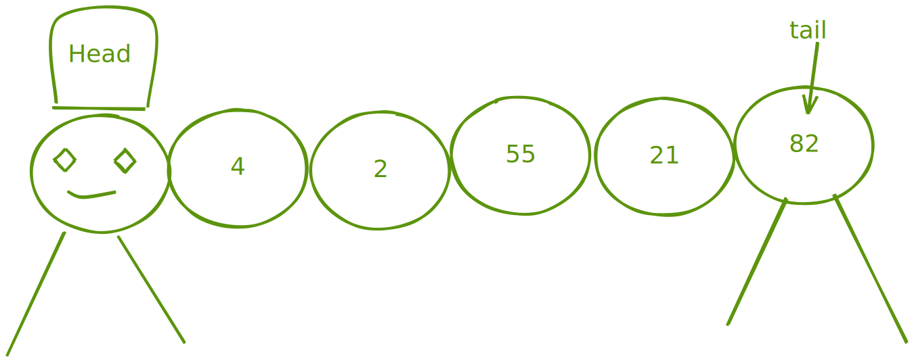
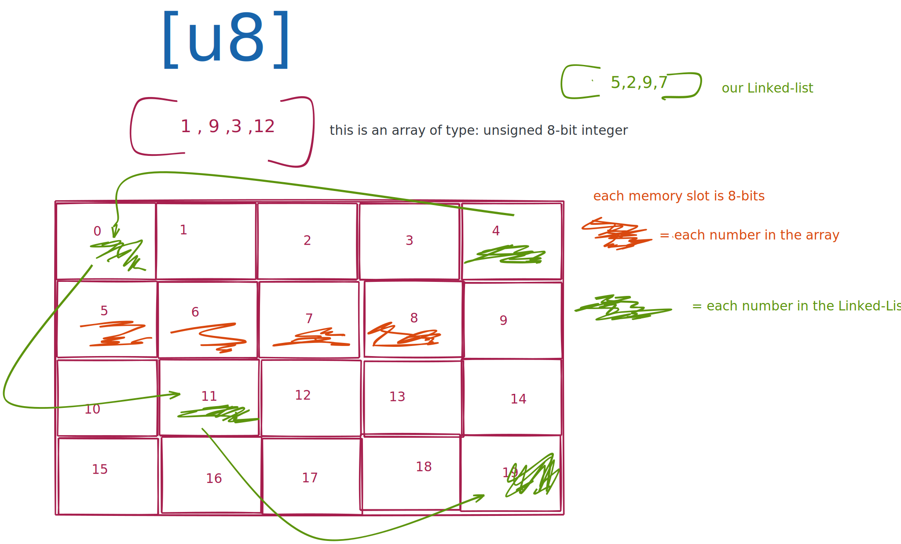
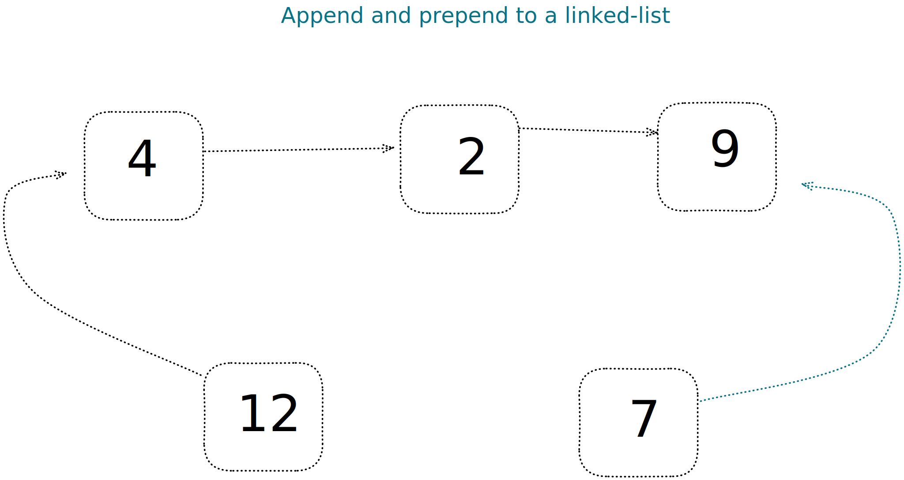

# Linked lists



`Linked lists` are similar to arrays, the look almost the same from a mentel model perspective.
One big difference is that `linked lists` are not allocated in the memory `back-to-back` like arrays does. This is a really cool feature with linked lists is that we can spread the memory slots in different places. What makes them bound to eachother` (the nodes)` is via pointers.
This is a really cool feature with `linked-lists`, that's ways inerting new data in to our list is takes a `O(1)` constant time complexity.

`Linked lists` are build via Nodes which is kind of a box that contains the data it is hold on to and a pointer to the next node `(if it is a singly-linked-list)`.

retriving a given `node` is therefore a slower operation comparing to `arrays`.
`O(n)` linear time complexity, because we have to traverse the list until we find the node we are searching for.



## Singly Linked List

A data structure contains fo nodes. Each node has a node the point to the next node.
The first `node` is called the `head` and the last `node` that will not have any next `node`
is called the `tails`.

```
0 -> 2 -> 3 -> 22 -> Maybe(node) // either node ore nothing
```

`perpend and append to a linked list`


**Operations time complexity**

- Access the head: `O(1)`
- Access the tail: `O(n)` we need to traverse here
- Access the middle `O(n)`
- Insert/Remove from the head `O(1)`
- Insert/Remove from the tail `O(n)` to access + `O(1)`
- Insert/Remove from the middle node `O(n)` to access + `O(1)`
- Searching `O(n)`

## Doubly linked list

Similar to a `Single linked list` but now we have a pointer to next node and the previous node.
The doubly list is powerful but something to know is that a doubly list would take up more memory since we keep the reference to the precious node as well.

```
0 <-> 2 <-> 3 <-> 22 <-> Maybe(node) // either node ore nothing
```

**Operations time complexity**

- Access the head: `O(1)`
- Access the tail: `O(1)`
- Access the middle `O(n)`
- Insert/Remove from the head `O(1)`
- Insert/Remove from the tail `O(1)`
- Insert/Remove from the middle node `O(n)` to access + `O(1)`
- Searching `O(n)`
