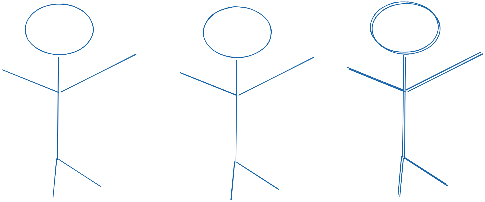

# Queue

Follows the `FIFO` principle comparing to the `Stack`, First in first out.
Your mental model in this case would be a line of people that standing to get their concert ticket first.
First inline will get the ticket first.

Time complexity of different methods are similar to how they are when using stacks.
The following are a queue's standard operations and their
corresponding time complexities:

- `Enqueuing an element into the queue`: O(1) constant time complexity
- `Dequeuing an element of the queue`: O(1) constant time complexity
- `Peeking an element into the front`: O(1) constant time complexity
- `Searching`: O(n) constant time complexity
