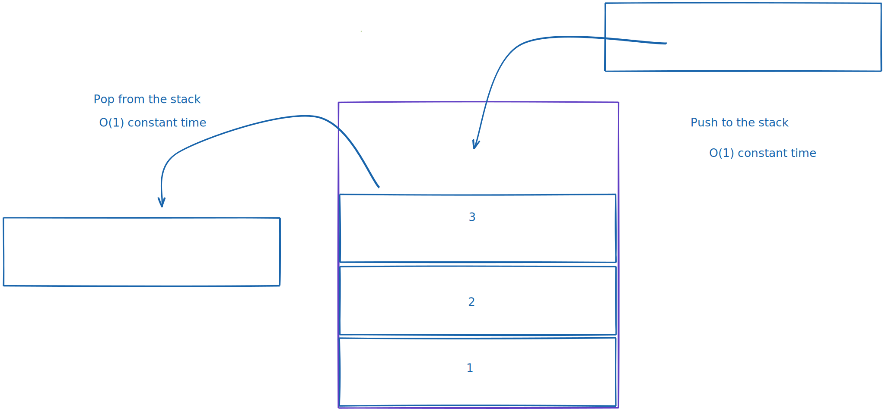

# Stacks

Stack is a data structure with some simple rules but really useful in our daily job. A stack is exactly what it sounds like.
Think of stack of books. tou can only pick the one on the top elsways everything would collapse.
When you add a new book tou will can only keep adding to the stack so on the top of the book stack.
This principle is called `LIFO` in computer science terms, `last in first out.`
Last element you put on your stack will be the first you pop from the stack,
A stack is similar to a dynamic array. We can implement a stack either with a `linked list` ore a array.

## time complexity for stacks

- **Pushing to the stack** O(1) constant
- **Popping to the stack** O(1) constant
- **Peeking element on the top** O(1) constant
- **Searching, traverse** O(n) linnear

