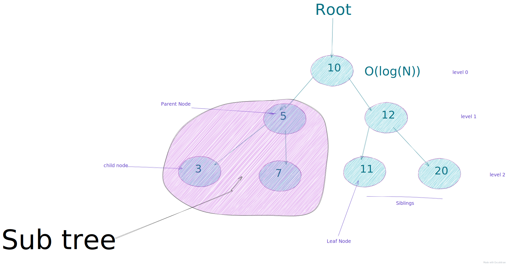

# Trees

Tree is a special type of a `Graph`.
We call it tree in Computer since terms but I like to visualize it as a tree that is up side down.
The tree root is now on the very top and we start from there to traverse downwards.

The very top of the `tree` is called the `root` node.

_Where can we found trees in real life?_
A good example is is the `DOM`. If you are a front end developer you probably know what I am talking about.
The `DOM` is a `tree` data structure with child nodes and edges.

There are a lot different types of `trees` that we use as data structures, One of the most common is the `Binary search tree`(BST).

Every path that starts from the root and ends ond of the bottom nodes is called a `branch`.
`Git` is a good mental model in this case.
The bottom nodes, we call them leafs nodes.

### time complexity/space complexity

- `Storing`: `O(n)` in space
- `Traverse`: `O(n)` in time, if traversing all n-nodes
- `Traverse`: `O(log(N))` in time, if traversing one side of the tree for example an `BST`

## terms

- `Path` − Path refers to the sequence of nodes along the edges of a tree.
- `Root` − The very top of the tree, only one root node.
- `Parent` - Node upwards the next node is the parent node
- `Children` - Nodes below the previous level are children nodes
- `Leaf` - The node which does not have any child node is called the leaf node.
- `Subtree` - Subtree represents the descendants of a node.
- `Keys` - Key represents a value of a node based on which a search operation is to be carried out for a node.

## Pseudo code for BST insert method

1. Check if there is a root node, if not then `newNode` is our new root
2. keep track if the root
3. check if the value we insert is less then our root node
4. if yes then traverse the left side
5. if there is no current.left then current left is the new node, else keep traversing down the branch.
6. else do the same thing on the right side
